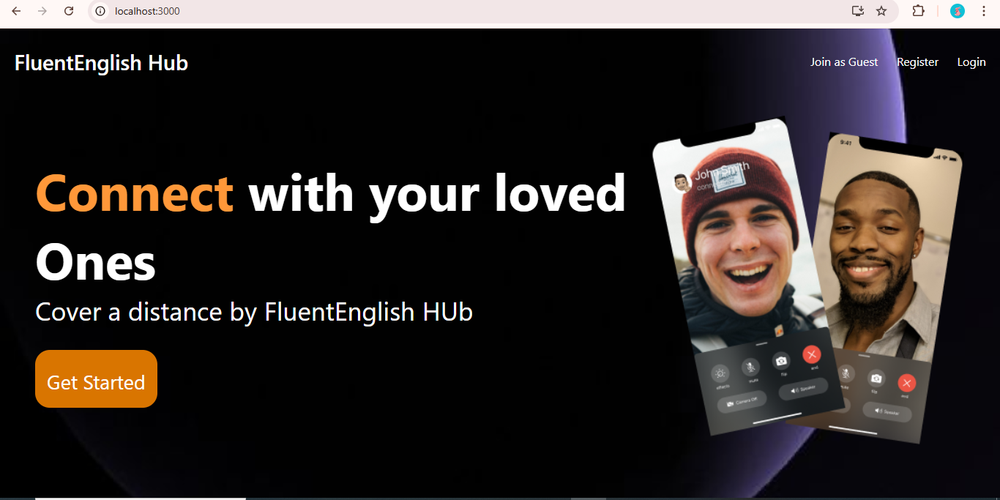
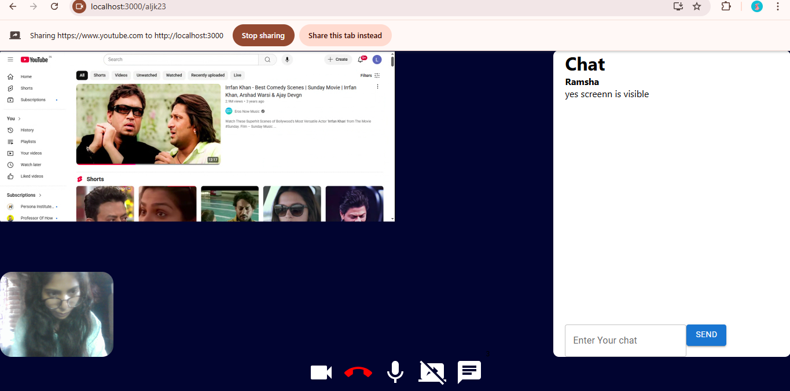

# 🌍 Fluent English Hub

**Fluent English Hub** is a simple yet effective website designed to help users improve their English skills. It provides interactive content, vocabulary exercises, grammar lessons, and basic communication practice and video call with real time chat.

## 🚀 Features
- 🎯 **Learn Grammar** – Easy-to-understand grammar explanations.
- 📖 **Vocabulary Builder** – Improve English with word lists & exercises.
- 🎙️ **Basic Conversations** – Learn common phrases for daily communication.
- 🌐 **Simple & Responsive UI** – Clean, 
 - **Live Chat + Video Call** – Practice English with real-time chat and video
mobile-friendly design.
- ⚡ **Interactive Elements (JavaScript)** – Basic animations & dynamic features.

## 🛠️ Tech Stack
 ## Frontend: HTML, CSS, JavaScript, React.js

 ## Backend: Node.js, Express.js

 ## Database: MongoDB


## 🔧 Installation & Setup
1. **Clone the repository:**
   ```sh
   git clone https://github.com/Ruksana-khatun/fluent-english-hub.git
   cd fluent-english-hub
   cd backend
   Install dependencies
   npm install
   cd src
   nodemon app.js/node app.js
   cd frontend
   Install dependencies
   npm install
   Run the app
    npm start
    http://localhost:3000/
    Run the main file
    index.html open with live server

Here is VIDEO call slide image

   
   